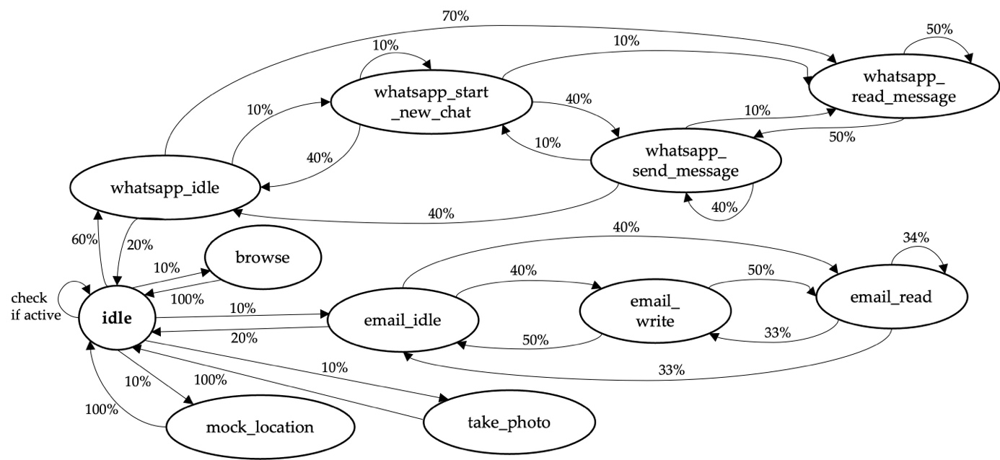

# README

This is a collection of scripts for the automatic population of multiple smartphones in order to simulate a crime case. While most scripts only work for Android smartphones, some should be also applicable to Apple iPhones.

Michel, M.; Pawlaszczyk, D.; Zimmermann, R. AutoPoD-Mobile—Semi-Automated Data Population Using Case-like Scenarios for Training and Validation in Mobile Forensics. Forensic Sci. 2022, 2, 302-320.

These scripts are part of the EU project FORMOBILE. This project has received funding from the European Union’s Horizon 2020 - Research and Innovation Framework Programme, H2020-SU-SEC-2018, under grant agreement no. 832800


## General functionality

The scripts are bundled in `fsm_main.py`. This file defines a Finite State Machine in which the scripts are executed automatically.
The fsm is as follows:



The percentages on the transitions are the transition probabilities that can be manually set in `./messenger/transition_matrix.csv`.


## Setup
### Requirements
First make sure you have the requirements for this project installed.
```bash
pip install -r requirements.txt
```

## Android debug bridge

Android debug bridge (Adb) has to be installed and running on your pc. To use adb with the phones, USB debugging has to be enabled in the developer options of the devices and the devices need to be in file transfer mode.

On Debian/Ubuntu based Linux distributions you may install adb via:

```bash
sudo apt install adb
```

To start the adb daemon on your PC run:

```bash
adb devices
```
The output should list all serial numbers of the connected devices followed by 'device'.

## Config File

The config file defines the people that should be a part of the case as well as their mobile phones. 
Additionally, this file specifies which people communicate with each other and whether the communication occurs via WhatsApp or Email.

Lastly, the config file defines device specific inputs that the corresponding script will execute. However, these buttons have to be discovered manually.

Please refer to `Documentation config_file.pdf` for additional information.

## Google Cloud Project

In order to be able to automatically send Emails and set Google Calendar events, you need to have at least one Google account. 
With this Google account you have to set up a Google Cloud project in which you will need to enable the Google Calendar API and the Google Mail API.
Lastly, you need to configure an OAuth screen within this project and download the `credentials.json` for each project.

For more detailed instructions please refer to `Documentation of scripts.pdf`


## Amazon Dataset

The [Amazon topical-chat Dataset](https://github.com/alexa/Topical-Chat) is a great starting point for conversational background noise in smartphones.
The dataset has to be stored in the `datasets/amazon` folder. 

On Linux you can run these commands to download the training set.
```bash
wget -P ./datasets/amazon/ https://raw.githubusercontent.com/alexa/Topical-Chat/master/conversations/train.json
```

## Reddit Dataset

Using Reddit comments is another great way to generate datasets for converstional background noise.
Contrary to the amazon dataset, this dataset can contain current information.

In order to extract Reddit comments from Reddit Threads please refer to the instructions of [Subreddit Comments Downloader](https://github.com/pistocop/subreddit-comments-dl).

Included in this repository are scripts that format the downloaded data to be used with the WhatsApp and Email scripts.